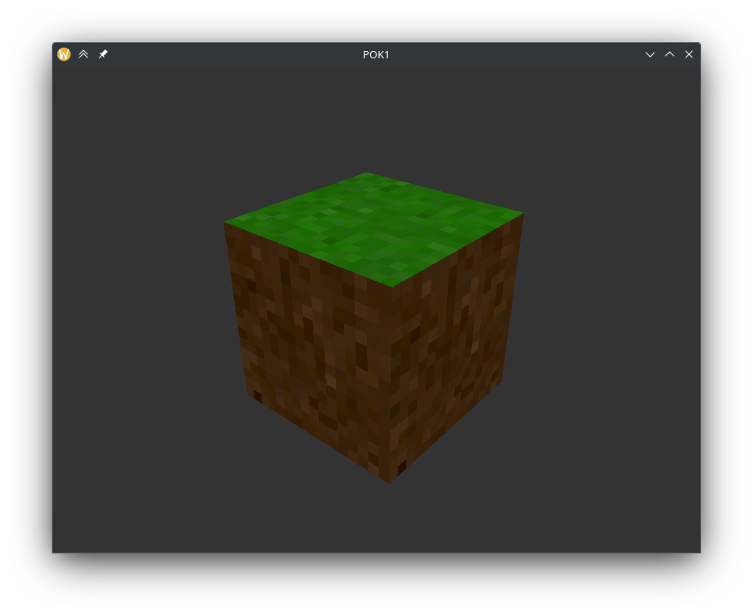
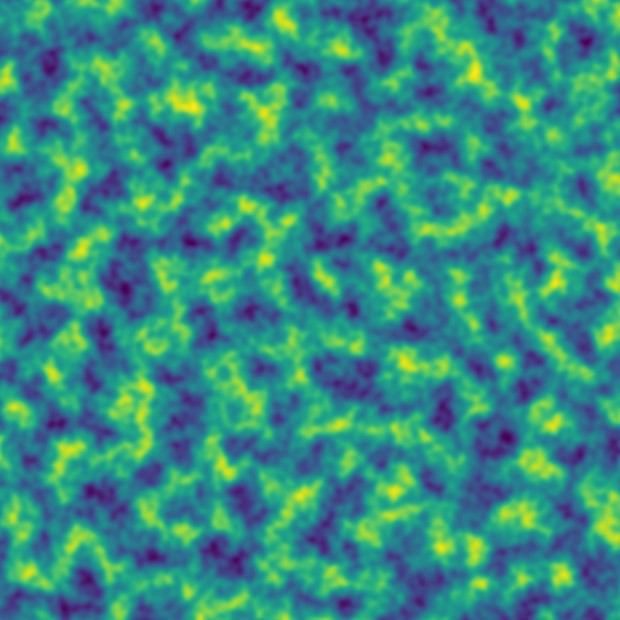

---
layout: layout/pok.njk

title: "Absolument pas Minecraft"
authors:
  - Paul Vietor

date: 2023-09-20

temps: 1
tags:
  - "OpenGL"
  - "GLSL"
  - "C++"
  - "Bruit simplexe"

résumé: Génération et affichage d'un monde composé de voxels.
---

[Dépôt Github](https://github.com/lauravietor/POK1_Not_Minecraft)

Mon objectif pour ce POK est de créer un programme qui génère un monde composé de voxels, puis affiche ce monde et permet se se déplacer dedans.

## Techologies, bibliothèques et ressources

J'ai décidé de l'écrire en C++, en utilisant OpenGL pour l'affichage.  
De plus, j'utilise quelques bibliothèques supplémentaires pour gérer la fenêtre ([GLFW3](https://www.glfw.org/)), charger des images ([stb_images](https://github.com/nothings/stb/blob/master/stb_image.h)), créer certains objets mathématiques tels que des matrices ([glm](https://github.com/g-truc/glm)), et accéder au fonctions OpenGL ([glad](https://glad.dav1d.de/)).  
Enfin, pour apprendre OpenGL, j'utilise le site [LearnOpenGL](https://learnopengl.com), j'utilise également [cppreference](https://en.cppreference.com/w/).

## Objectifs pour le premier point POK

Je ne connaissais pas OpenGL avant de débuter ce POK donc pour le premier point, j'aimerais réussir à afficher un premier cube avec une texture et de l'éclairage basique.

Cela peut paraître bien peu, mais les quelques bibliothèques avec lesquelles je travaille sont d'assez bas niveau : par exemple les seules formes géométriques qu'il est possible d'afficher avec OpenGL sont des triangles, à partir de leurs sommets, des lignes et des points. Il faut donc transformer tout ce qu'on veut afficher en un ensemble de telles formes.

Ainsi, l'affichage de ce simple cube requiert :
- La création d'une fenêtre
- L'initialisation d'OpenGL
- L'initialisation des données nécessaires au processeur graphique :
 - Sommets du cube
 - Triangles à dessiner à partir de ces sommets
 - Textures à utiliser
 - Vecteurs normaux aux faces pour l'éclairage
- Création de *shaders* pour placer le cube devant la "caméra" et dessiner les textures au bon endroit

Ainsi, ça fait un certain nombre de concepts à apprendre, donc même si c'est basique, ça me permettrait d'apprendre les bases d'OpenGL, et je pourrai enchaîner sur quelque chose de plus complexe pour la seconde moitié du POK.

## Progrès après le premier sprint

Pour ce premier point POK, j'ai réussi à afficher un cube texturé, qui tourne, mais sans réel éclairage, puisque la structure de données que j'utilisais ne permet pas de le faire de façon pratique, il va donc falloir que j'en change.

- Rendu indicé : 8 sommets, et une liste de 36 indices qui définissent les 12 triangles
- Transformations utilisant 3 matrices :
 - Matrice de modèle, qui permet de placer l'objet dans le monde et de le faire tourner
 - Matrice de vue, qui permet de placer la "caméra" dans le monde
 - Matrice de projection, qui permet d'avoir un rendu en perspective
- Texture *cube map* : une texture spéciale qui est à la surface d'un cube centré en (0, 0, 0), OpenGL nous permet de récupérer la couleur qui se trouve dans une direction

## Objectifs pour le deuxième point

- Éclairage
- Génération d'un monde en utilisant une fonction de bruit (~~bruit de Perlin~~ ou bruit simplexe)
- Création dynamique des cubes à afficher composant ce monde
- Déplacement dans le monde (Dans les 3 dimensions, et bouger le regard avec la souris)
- Support de la manette ?
- Optimisations ?

## Progrès après le deuxième sprint

Dans ce deuxième sprint j'ai réussi à réaliser presque tous les objectifs que je m'étais fixé. Je n'ai malheureusement pas eu le temps d'implémenter un support manette, ni d'optimiser le rendu, mais cela n'est de toute façon pas nécessaire puisque j'atteins très largement les 60 images par secondes que peut afficher mon écran :

<video controls>
<source src="mouvement.webm" type="video/webm"/>
Votre navigateur ne supporte pas les vidéos au format webm.
</video>

Pour l'implémentation du bruit simplexe, je me suis principalement basé sur la description de l'algorithme présente sur [Wikipédia](https://en.wikipedia.org/wiki/Simplex_noise) et sur l'implémentation en GLSL donnée sur [The Book of Shaders](https://thebookofshaders.com/11/?lan=fr) ([implémentation](https://thebookofshaders.com/edit.php#11/2d-snoise-clear.frag)). 

J'ai d'abord fait une [implémentation en python](simplexnoise.zip), dont voici un exemple de résultat, avec 3 octaves :

J'ai ensuite porté cette implémentation en C++, celle-ci est disponible sur le dépôt Gihub du projet.

