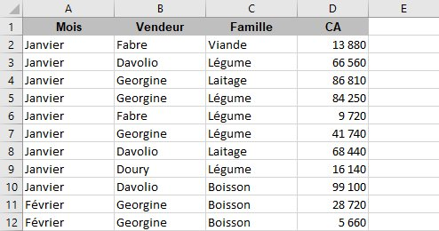
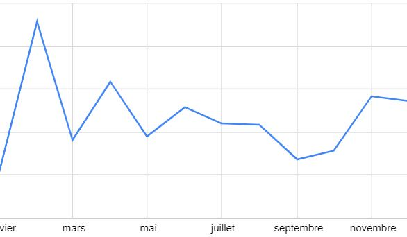

Imagine être un ingénieur et n'avoir aucune expérience avec la suite Office... 
Je ne suis pas du tout dans ce cas bien entendu, mais une piqûre de rappel ne fait jamais de mal. 

Je me suis principalement appuyé sur les MON de mes prédécésseurs : [Utilisation d'Excel dans l'analyse de données](https://francoisbrucker.github.io/do-it/promos/2023-2024/Lucie-Le-Boursicaud/mon/temps-1.2/) de Lucie, [Excel - Repartir sur de bonnes bases](https://francoisbrucker.github.io/do-it/promos/2023-2024/Lola-Bourdon/mon/temps-1.2/) de Lola, et [Un peu d'Excel/Google Sheets pour mourir moins idiot](https://francoisbrucker.github.io/do-it/promos/2023-2024/TAING-Henri/mon/temps-2.1/) de Henri.

J'ai aussi suivi la [formation d'OpenClassrooms](https://openclassrooms.com/fr/courses/7168336-maitrisez-les-fondamentaux-dexcel) sur les fondamentaux d'Excel, que j'ai parcouru en moins de temps qu'il ne fallait, car elle démarre de zéro, donc j'ai pu accélérer sur les premières parties. La première moitié n'est pas forcément intéressante si on a touché à Excel une fois dans sa vie, mais la 2e compense et offre des concepts bien plus intéressants, comme par exemple... 

### Les Tableaux Croisés Dynamiques (TCD)

Wow. Ca m'a ouvert les yeux. Je ne verrai plus jamais Excel de la même manière. 
Une partie du travail que j'ai fait sur ce MON était de réorganiser un Sheets que je maintenais semi-régulièrement où je garde une trace de mes achats ainsi que de mes budgets prévisionnels par mois. Sans trop plonger dans les détails de mes habitudes financières, en créer un et avoir une vision alternative des choses a répondu à quelques questions que je me posais sur mes dépenses. 

Mais qu'est-ce réellement ? Un TCD permet de résumer de grandes quantités de données en les regroupant et en les réorganisant selon des critères spécifiques. on peut facilement explorer les données en les filtrant, les triant et en les regroupant à la volée, et visualiser les résultats sous forme de tableaux récapitulatifs ou de graphiques. Les tableaux croisés dynamiques sont efficaces pour identifier des tendances dans les données. Admettons qu'on ait cette table : 

Tableau faisant partie des exercices pratiques, Maîtrisez les fondamentaux d'Excel, OpenClassrooms https://openclassrooms.com/fr/courses/7168336-maitrisez-les-fondamentaux-dexcel/7216018-realisez-des-tableaux-croises-dynamiques 

Un TCD va ici directement nous permettre d'effectuer des calculs sur ce tableur. Les logiciels comme Excel ou Sheets donnent des moyens d'en créer un à partir d'un tableau, en quelques clics. Disons que l'on veut voir quel est le chiffre d'affaire produit par type de produit et par mois. Dans le TCD, on va placer les produits en colonne, les mois en ligne, et calculer le CA à partir de ces infos; ce seront les valeurs du tableau. 

Exemple de TCD, Maîtrisez les fondamentaux d'Excel, OpenClassrooms https://openclassrooms.com/fr/courses/7168336-maitrisez-les-fondamentaux-dexcel/7216018-realisez-des-tableaux-croises-dynamiques 

On a tout de suite un tableau qui donne un **rapport** entre les produits, le chiffre d'affaire et le mois. On constate par exemple que les ventes de boissons sont faibles en janvier. Ce genre de tableau permet de tisser des liens clairs entre les données, et pouvoir en tirer des décisions éclairées. 

J'adore les Tableaux Croisés Dynamiques, et vous devriez aussi. 

### Interlude VBA 

Lorsque je cherchais des MON concernant Excel, j'en ai trouvé aussi parlant de VBA en parallèle, comme celui d'Agathe, [Excel et VBA](https://francoisbrucker.github.io/do-it/promos/2023-2024/Agathe-Rabachou/mon/temps-2.1/).

VBA est un langage de programmation qui permet d'automatiser des tâches sur les logiciels de la suite Office. Vu que j'ai la flemme de faire mes tâches à la main, ça a piqué mon intérêt. J'ai donc fait quelques leçons de [la formation qu'elle a suivi](https://www.excel-pratique.com/fr/vba), avant de me souvenir que je fais un MON sur Excel et je suis en train de m'éparpiller. Le MON était cependant très intéressant et je recommande de s'y pencher si VBA vous intéresse.

### Autres travaux perso 

A mes heures perdues je fais des tableurs sur des statistiques dans un jeu, pour optimiser mes actions au maximum. 

Ce tableau représente les dégâts d'un personnage selon ses caractéristiques (burst, tank, etc.), en fonction des PV de l'adversaire (1ère colonne). Pour me représenter les tendances rapidement, j'ai fait une ligne sparkline à la fin de chaque colonne, pour constater que Burst chute en efficacité bien plus vite que les autres à mesure que la cible a de plus en plus de PV. 

J'ai aussi essayé de représenter les mois de l'année où je dépense le plus... Etonnament difficile, le TCD que je faisais n'arrêtait pas de mettre les mois dans l'ordre alphabétique, ce qui est un enfer à représenter graphiquement...

Ces données ont été prises de mes logs depuis que je suis à Centrale, et selon ce graphe toute notion de responsabilité financière me quitte en février. Je suis bien content d'être en mars et être revenu à mes sens.

## Conclusion 

Ce MON consistait principalement à s'arrêter sur des notions que je trouvais particulièrement intéressantes; l'essentiel est déjà très bien expliqué dans les MON précédents, ainsi que les ressources qu'ils ont mis à disposition. Peut-être me servirai-je plus souvent d'Excel à titre personnel...

Je trouve aussi assez difficile de produire quelque chose de nouveau lorsque tant de personnes sont déjà passées avant nous sur le même sujet, surtout si on essaye de ne pas être redondant avec les MON précédents. 

## Bibliographie 

- [Un peu d'Excel/Google Sheets pour mourir moins idiot](https://francoisbrucker.github.io/do-it/promos/2023-2024/TAING-Henri/mon/temps-2.1/) de Henri Taing
- [Excel - Repartir sur de bonnes bases](https://francoisbrucker.github.io/do-it/promos/2023-2024/Lola-Bourdon/mon/temps-1.2/) de Lola Bourdon
- [Utilisation d'Excel dans l'analyse de données](https://francoisbrucker.github.io/do-it/promos/2023-2024/Lucie-Le-Boursicaud/mon/temps-1.2/) de Lucie Le Boursicaud
- [Excel et VBA](https://francoisbrucker.github.io/do-it/promos/2023-2024/Agathe-Rabachou/mon/temps-2.1/) d'Agathe Rabachou
- Maîtrisez les fondamentaux d'Excel, OpenClassrooms, https://openclassrooms.com/fr/courses/7168336-maitrisez-les-fondamentaux-dexcel 